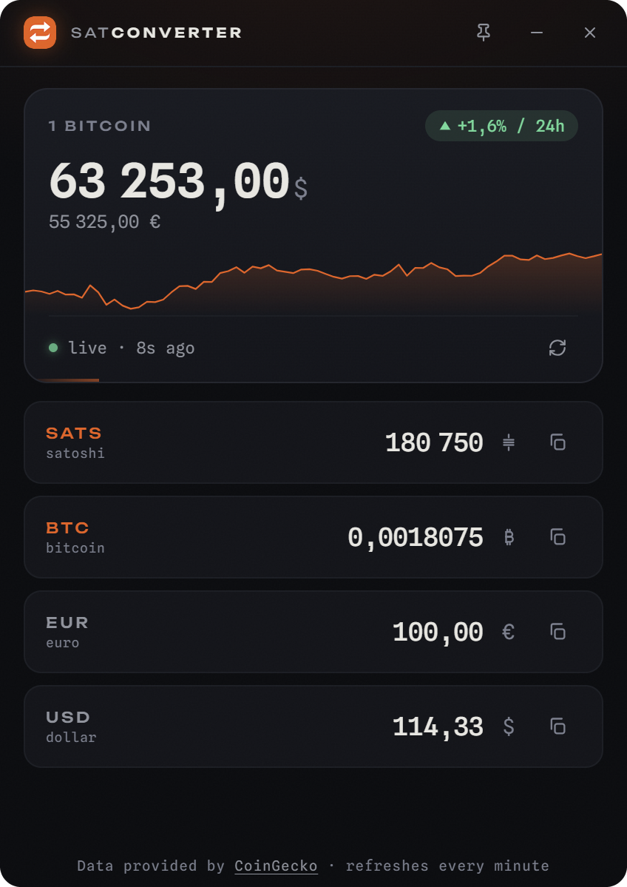

<p align="center">
  
</p>

<h1 align="center">SatConverter</h1>

<p align="center">
  Converts sats, BTC, EUR and USD instantly, with live Bitcoin prices.<br>
  A single 3 MB portable executable, built with Rust and Tauri, no runtime dependencies.
</p>

<p align="center">
  
</p>

## Download

Grab the latest installer from the [Releases](https://github.com/LoicPandul/SatConverter/releases) page. These builds are not signed (code signing certificates cost money and add nothing to the code), so your OS will warn you on first launch:

| Platform | File | First launch |
|---|---|---|
| Windows | `*-setup.exe` or `.msi` | SmartScreen warns: click "More info", then "Run anyway" |
| macOS | `.dmg` | Right-click the app, then "Open" |
| Linux | `.AppImage` (portable), `.deb` or `.rpm` | Nothing special, `chmod +x` the AppImage |

## Verify your download

Each release ships a `SHA256SUMS` manifest signed with the author's [minisign](https://jedisct1.github.io/minisign/) key. The public key is:

```
RWTz3c4gUmglCX5Uvjthigz1ts3TS3ZSdhRNpFgOJRW/Wr4XjGlqTR3O
```

Download `SHA256SUMS` and `SHA256SUMS.minisig` into the same folder as your installer, then run the two checks for your platform: the signature proves the hash list comes from the author, the hash proves your file was not altered.

### Windows (PowerShell)

Get `minisign.exe` from the [official releases](https://github.com/jedisct1/minisign/releases) (win64 zip, `x86_64` folder).

```powershell
minisign -Vm SHA256SUMS -P RWTz3c4gUmglCX5Uvjthigz1ts3TS3ZSdhRNpFgOJRW/Wr4XjGlqTR3O

$file = "SatConverter_0.1.0_x64-setup.exe"   # the file you downloaded
$hash = (Get-FileHash $file).Hash.ToLower()
if (Select-String -Quiet -SimpleMatch "$hash  $file" SHA256SUMS) { "OK: $file matches" } else { "MISMATCH - do not run this file" }
```

### macOS

```sh
brew install minisign
minisign -Vm SHA256SUMS -P RWTz3c4gUmglCX5Uvjthigz1ts3TS3ZSdhRNpFgOJRW/Wr4XjGlqTR3O
shasum -a 256 --check SHA256SUMS --ignore-missing
```

### Linux

```sh
sudo apt install minisign   # or your distribution's equivalent
minisign -Vm SHA256SUMS -P RWTz3c4gUmglCX5Uvjthigz1ts3TS3ZSdhRNpFgOJRW/Wr4XjGlqTR3O
sha256sum --check SHA256SUMS --ignore-missing
```

## Features

- Type in any field: the 3 others update instantly
- Live price, 24h change and sparkline, refreshed every minute
- Historical mode: pick any minute since 1 January 2017 and convert at that minute's price, with the change since then
- Copy any value in a click, pin the window always on top
- Dark and light themes, your choice is persisted
- Works offline with the last known price
- Remembers its window position, runs as a single instance
- Number formats follow your system locale

## Build from source

Requires [Rust](https://rustup.rs/).

```powershell
cd src-tauri
cargo run              # development
cargo build --release  # target/release/satconverter(.exe)
```

The frontend (`ui/`) is plain HTML, CSS and JavaScript: no Node, no build step.

The date and price logic of the historical mode has unit tests, run with [Node](https://nodejs.org/) 22 or later:

```powershell
node --test "tests/*.test.js"
```

## License

Released into the public domain under the [Unlicense](LICENSE).

Live prices provided by [CoinGecko](https://www.coingecko.com/en/api), historical prices by [Bitstamp](https://www.bitstamp.net/api/).
