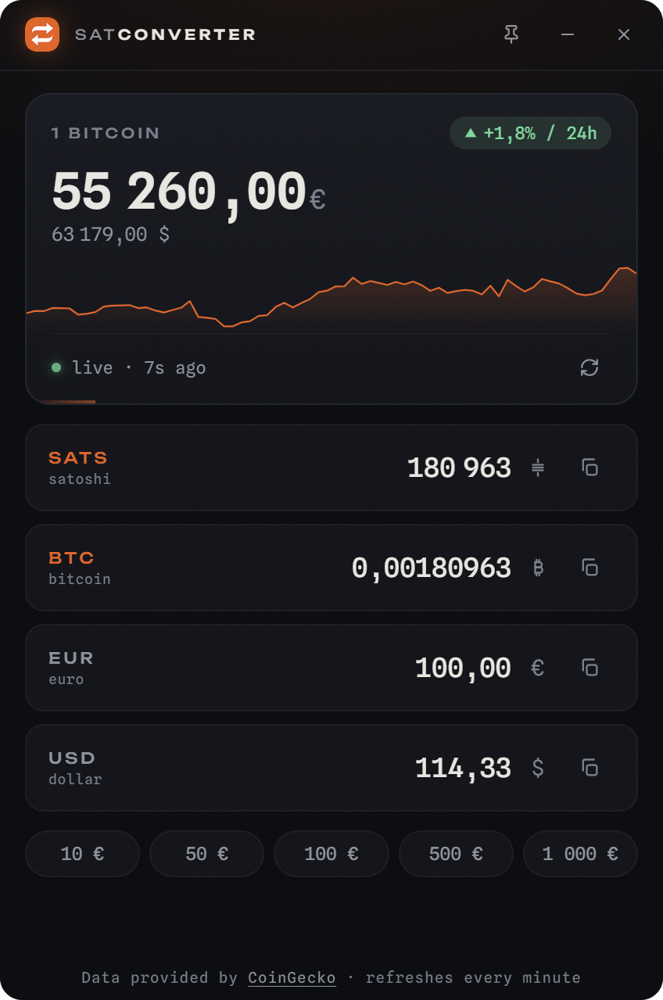

<p align="center">
  
</p>

<h1 align="center">SatConverter</h1>

<p align="center">
  A lightweight desktop converter for instant sats, BTC, EUR and USD conversions with live Bitcoin prices.
</p>

<p align="center">
  
</p>

## Features

- **4-way instant conversion** — type in any field (sats, BTC, EUR, USD), the three
  others update live. The field you are editing is marked with an orange rail.
- **Live Bitcoin price** — CoinGecko, auto-refresh every 2 minutes (subtle progress
  bar), manual refresh button or `Ctrl+R`.
- **24h sparkline** and 24h change badge.
- **One-click copy** — machine-readable values (dot decimal, no grouping), ready to
  paste anywhere.
- **Quick presets** — 10 / 50 / 100 / 500 / 1 000 €.
- **Always-on-top pin** in the titlebar (state persisted).
- **Offline-friendly** — last known price shown from cache with an explicit
  offline badge; self-hosted fonts, no CDN.
- **Single instance** — relaunching focuses the existing window.
- **Remembers its window position** between sessions.
- **Locale-aware numbers** — grouping and decimal separators follow your system
  locale, input accepts both `.` and `,` decimals.
- `Esc` clears all fields.

## Why it's light and fast

The Rust side is a thin shell: window, OS clipboard, single-instance lock and
position persistence. Everything else runs in the OS-provided WebView2 — no
bundled browser, no Node, no bundler, no runtime dependencies. The release
binary is a single small `.exe` with all assets embedded.

## Build & run locally

Prerequisites (Windows):

- [Rust](https://rustup.rs/) (stable, MSVC toolchain)
- Microsoft Visual Studio C++ Build Tools
- WebView2 runtime (preinstalled on Windows 10/11)

```powershell
git clone https://github.com/LoicPandul/SatConverter.git
cd SatConverter/src-tauri

# Development build + run
cargo run

# Optimized release build
cargo build --release
# → target/release/satconverter.exe  (single portable executable)
```

No `npm install`, no build step for the frontend: `ui/` is plain HTML/CSS/JS,
embedded into the binary at compile time.

### Optional: installer

With [tauri-cli](https://v2.tauri.app/reference/cli/) installed
(`cargo install tauri-cli`), `cargo tauri build` produces an NSIS installer in
addition to the portable executable.

## Project layout

```
SatConverter/
├── ui/                  # Frontend (vanilla HTML/CSS/JS, no build step)
│   ├── index.html
│   ├── styles.css
│   ├── main.js
│   ├── fonts/           # Self-hosted variable fonts (offline-ready)
│   └── assets/
├── src-tauri/           # Rust shell
│   ├── src/main.rs      # Window, clipboard, single-instance, position memory
│   ├── tauri.conf.json  # Window config, strict CSP, bundling
│   ├── capabilities/    # Scoped window permissions
│   └── icons/
├── assets/              # Brand assets
└── docs/                # Progress log, screenshots
```

## Architecture notes

- **Prices** are fetched directly from the webview (CoinGecko's public API is
  CORS-enabled) — no HTTP stack in Rust, smaller binary.
- **Cache** (last prices, sparkline, pin state) lives in `localStorage`;
  window position is persisted by `tauri-plugin-window-state`.
- **Security**: strict CSP (`connect-src` limited to the CoinGecko API, no
  remote scripts/styles/fonts), capability-scoped window permissions only
  (minimize, close, always-on-top, drag).

## License

[Unlicense](LICENSE) — public domain.
